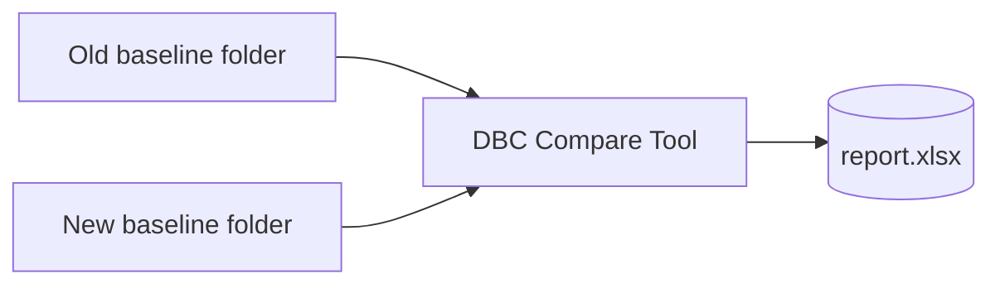
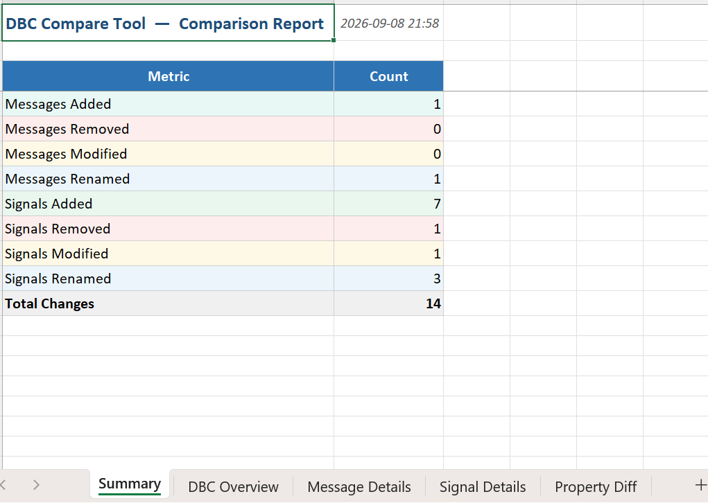
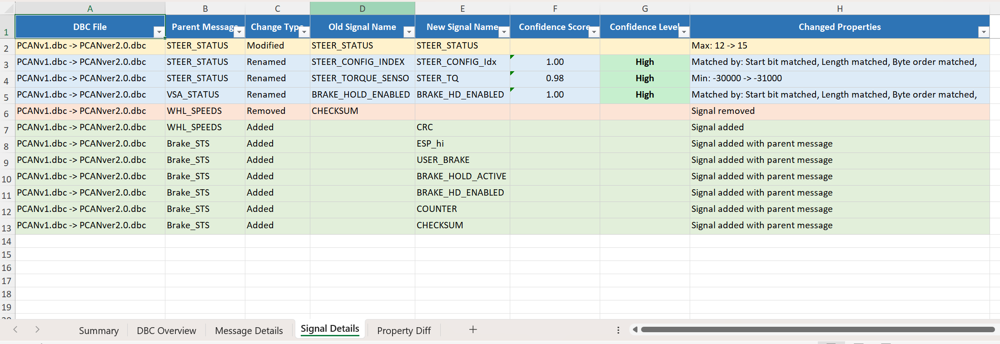
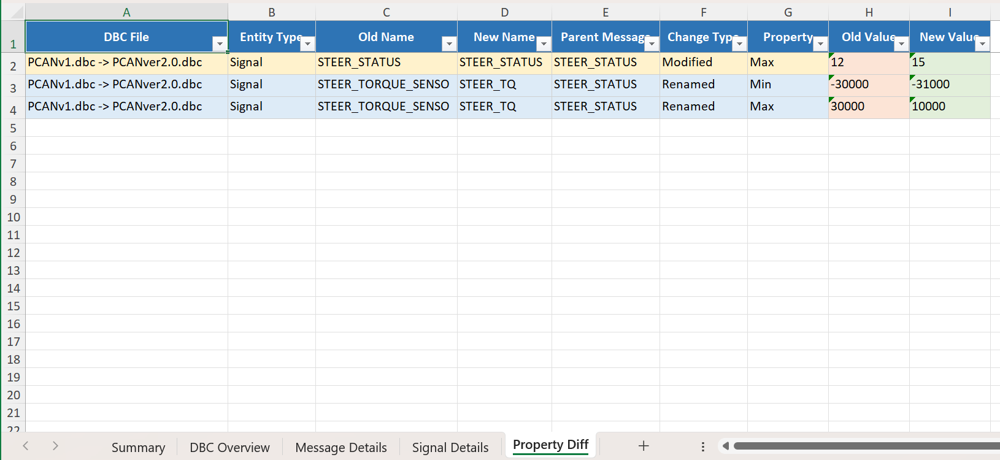
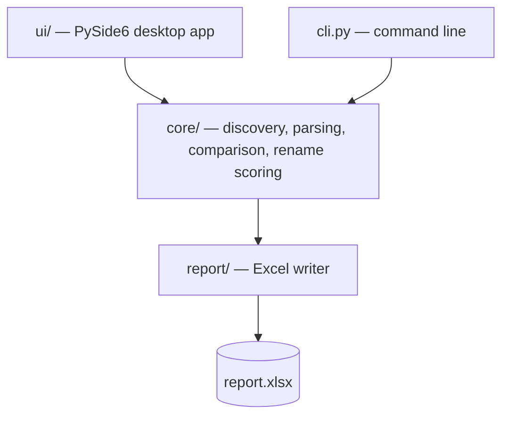

# DBC Compare Tool

> Compare two Automotive CAN DBC baselines and see what actually changed.

A Windows desktop + CLI tool that compares DBC baseline folders and writes an engineering-grade Excel change report.


[](https://github.com/longvo92/dbc-compare-tool/actions/workflows/test.yml)
[](https://github.com/longvo92/dbc-compare-tool/releases/latest)
[](LICENSE)
[](https://www.python.org/)
[](#requirements)

---

## What it does

A text diff shows you which characters moved. This shows you which **messages and signals** changed.



It discovers every `.dbc` file recursively, pairs the corresponding databases — even renamed ones — compares messages and signals, detects likely renames, and writes one multi-sheet workbook.

### What it detects

|                        | DBC file | Message | Signal |
| ---------------------- | :------: | :-----: | :----: |
| Added / Removed        |    ✅     |    ✅    |   ✅    |
| Modified               |          |    ✅    |   ✅    |
| Renamed                |    ✅     |    ✅    |   ✅    |
| Value tables (`VAL_`)  |          |         |   ✅    |
| Comments (`CM_`)       |          |    ✅    |   ✅    |
| Parse error            |    ✅     |         |        |

---

## Features

- **Folder-level comparison** — recursively discovers all `.dbc` files in both baselines and reports every message and signal change between them.
- **DBC file pairing** — matches files by relative path first, then by CAN ID overlap and message-layout similarity, so a renamed `.dbc` is still compared as the same database.
- **Manual pairing** — a **Manual Pairing…** dialog lets you pick the new-baseline counterpart for each old file when automatic pairing is not what you want.
- **Message rename detection** — scored over CAN ID, DLC, transmitter, cycle time, signal count and signal layout, so a message whose CAN ID changed can still be matched.
- **Signal rename detection** — scored over start bit, length, byte order, signedness, factor/offset, unit and receivers, with name similarity as supporting evidence. Event Matrix-style messages, where those properties repeat across dozens of signals, switch to a name-driven mode that can never report High confidence.
- **Rename review** — when a complete manual pairing is used, every detected signal rename is shown with its confidence before export; reject one and it is reported as Removed + Added instead.
- **Value tables and comments** — `VAL_` value tables are compared for signals, `CM_` comments for both messages and signals.
- **Change-type filter** — include only Added / Removed / Modified / Renamed in the report.
- **Robust parsing** — an unparsable DBC is flagged `Parse Error` and the rest of the comparison continues; UTF-8, UTF-8 with BOM and the CANdb++ default encoding are all handled.
- **CLI mode** — same comparison engine, scriptable for CI or batch runs.

---

## Quick start

Ready-to-run Windows builds are attached to each [release](https://github.com/longvo92/dbc-compare-tool/releases) — download the one-file `.exe` and nothing needs to be installed.

Sample baselines for a first run live in [examples/old](examples/old) and [examples/new](examples/new):

```powershell
dbc-compare-tool --old examples\old --new examples\new --out comparison.xlsx
```

---

## The report

One workbook, five sheets:

| Sheet             | Contents                                                                                                                                                             |
| ----------------- | -------------------------------------------------------------------------------------------------------------------------------------------------------------------- |
| `Summary`         | Change counts by category, report title, generation time                                                                                                             |
| `DBC Overview`    | One row per file pair: status (`Matched` / `DBC Added` / `DBC Removed` / `DBC Renamed` / `Manually Paired` / `Parse Error`), pairing confidence, message/signal counts |
| `Message Details` | Every added, removed, modified or renamed message                                                                                                                    |
| `Signal Details`  | Every added, removed, modified or renamed signal, with rename confidence                                                                                             |
| `Property Diff`   | One row per changed property, before and after                                                                                                                       |

Rows are colour-coded by change type — 🟩 Added, 🟥 Removed, 🟨 Modified, 🟦 Renamed — and CAN IDs are written in hexadecimal (`0x1A3`).

**`Summary` — the headline numbers:**



**`Signal Details` — what changed, and how confident the rename match is:**



**`Property Diff` — the old and new value of every property that moved:**



---

## Rename detection

Rename detection is a heuristic, not a proof. Structural properties carry the score and the name is supporting evidence, so a signal keeps its identity through a pure rename:

| Property  | Old            | New         |
| --------- | -------------- | ----------- |
| Name      | `VehicleSpeed` | `VehSpeed`  |
| Start bit | 16             | 16          |
| Length    | 16             | 16          |
| Factor    | 0.01           | 0.01        |
| Unit      | km/h           | km/h        |

→ reported as **Renamed**, High confidence.

Two limits are worth knowing before you trust a verdict:

- Event Matrix-style messages have dozens of structurally identical signals, so their matches lean on name similarity and can never reach `High`.
- Review a detected rename whenever the difference between `Renamed` and `Removed + Added` matters to you.

Scoring weights and known edge cases are in [docs/architecture.md](docs/architecture.md).

---

## Requirements

- Windows (the UI and path handling target Windows; the core engine is platform-agnostic)
- Python 3.9 or newer, to run from source
- Runtime dependencies: `cantools`, `openpyxl`, `PySide6` — `pyinstaller` is needed only to build the executable

---

## Install from source

```powershell
git clone https://github.com/longvo92/dbc-compare-tool.git
cd dbc-compare-tool
py -m venv .venv
.\.venv\Scripts\python.exe -m pip install -r requirements.txt
.\.venv\Scripts\python.exe -m pip install -e .
```

The `-e .` step is required: the package lives under `src/`, so `python -m dbc_compare_tool` only resolves after an editable install. It also puts two commands on the environment's `PATH` — `dbc-compare-tool` (CLI) and `dbc-compare-tool-gui` (desktop app).

---

## Usage

**GUI:**

```powershell
.\.venv\Scripts\python.exe -m dbc_compare_tool
```

**CLI:**

```powershell
.\.venv\Scripts\python.exe -m dbc_compare_tool.cli --old path\to\old --new path\to\new --out report.xlsx
```

All three arguments are required and `--out` must end in `.xlsx`. Exit codes: `0` success, `1` parse or write failure, `2` bad arguments or missing folder.

`run_gui.bat` and `run_cli.bat` at the repository root do the same, using `.venv` in the repo.

---

## Development

Run the test suite:

```powershell
.\.venv\Scripts\python.exe -m unittest discover -s tests
```

CI runs the same suite on Linux and Windows against Python 3.9, 3.10 and 3.12, plus a CLI comparison of the bundled example baselines. The comparison engine and the report writers have no UI dependency, so those runs install `cantools` and `openpyxl` only — no test imports Qt.

Build distributables (zipapp and one-file `.exe`):

```powershell
.\.venv\Scripts\python.exe scripts\build.py        # both
.\.venv\Scripts\python.exe scripts\build.py exe    # exe only
```

### Structure



The desktop app and the CLI share the same engine, and that engine has no UI dependency. Outside the package: `scripts/build.py` produces the distributables, `scripts/release_check.py` gates a release, `examples/` holds the sample baselines, and `tests/` mirrors the layers above.

## Documentation

- [User Guide](resources/help/user_guide.md) — step-by-step usage, also in the app's Help menu
- [Changelog](CHANGELOG.md) — every released version, also in the app's Help menu
- [Architecture](docs/architecture.md) — layers, data flow, rename scoring weights, validation status

## Contributing

Issues and pull requests are welcome. For changes to comparison or rename-detection logic, add or update tests under `tests/`, and keep the comparison engine free of UI imports so it stays usable from the CLI and CI.

## Author

**Long Vo Thien**

## License

[MIT](LICENSE) © Long Vo Thien
