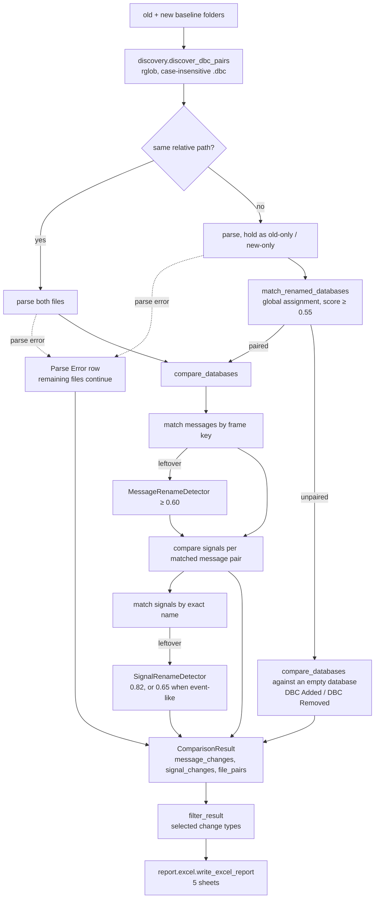

# Architecture

## Goals

This project is a local Windows desktop application for automotive engineers comparing DBC releases. The core comparison logic is kept independent from the UI so it can be tested and reused from CLI.

## Layers

1. Parser
   - Reads `.dbc` files through cantools.
   - Extracts messages, signals, multiplexing metadata, extended-frame state, value tables (`VAL_`), comments (`CM_`), and common message cycle-time attributes.
   - Keeps parsed output in small dataclasses.

2. Comparison Engine
   - Discovers `.dbc` files in old and new baseline folders.
   - Compares files with the same relative path first.
   - Pairs old-only and new-only `.dbc` files using inventory-weighted keywords and content, then solves a maximum-score one-to-one assignment (`core/pairing.py`).
   - Matches messages by frame key first; still-unmatched messages run through structural rename detection before being treated as added/removed.
   - Compares value tables and comments as regular properties, surfaced in change descriptions and the Property Diff sheet.
   - `DbcComparator(include_unchanged=True)` retains exact matches as `Unchanged`; default results remain changes only. Each detail entry carries OLD/NEW parent message and signal references for report context. Unchanged counts are excluded from `Total Changes`.
   - Accepts a caller-supplied pairing map (`compare_manual`) as an alternative to automatic file pairing.
   - `filter_result` retains requested change types and always preserves file pairs. Include Unchanged bypasses filtering.

3. Rename Detection Engine
   - Messages with the same frame key and a different name are exact renames (confidence 1.0).
   - Messages whose frame key also changed are matched via `MessageRenameDetector`, a structural scorer over DLC, transmitter, cycle time, signal count, and signal-layout overlap (name similarity is minor supporting evidence).
   - Signals are compared inside an already-matched message pair — which includes a pair matched by message rename, so the two messages may carry different CAN IDs. Signals left over after exact-name matching are scored via `SignalRenameDetector`, with a relaxed name-driven mode for Event Matrix-style messages.
   - DBC file pairing combines deterministic keyword/content scoring with global assignment. Message/signal rename detection remains automatic in both interfaces.

4. Report Generator
   - Writes a single Excel workbook; shared styling lives in `report/_style.py`.
   - Five sheets in order: `Summary`, `DBC Overview`, `Message Details`, `Signal Details`, and
     `Property Diff`.
   - Appends separate OLD/NEW Tx/Rx, frame IDs and technical properties; message Rx aggregates signal receivers. Summary records report mode and skipped parse-error count. Property Diff remains a table of changed properties only.

5. UI Layer
   - PySide6 desktop UI with an application-wide stylesheet.
   - Groups folder inputs/manual pairing under Baselines and output/export options under Report. The footer exposes compare/export/completion/failure states and keeps Run Compare and Open Report visible. Input controls and filters are locked during comparison/export.
   - The folder-to-folder Baseline Compare workflow, with its own Execution Log (`log_view`, cleared
     at the start of every run).
   - The controls sit in a `QScrollArea` so a small window scrolls instead of squeezing every
     group until its content is unreadable, and the primary action stays outside that scroll area so
     it is always reachable.
   - Runs comparison, pairing, and export on worker threads to keep the UI responsive.
   - Persists last-used folder paths and the report path via
     `QSettings("DbcCompareTool", "DBCCompareTool")` (Windows registry).
   - Help > Changelog renders `CHANGELOG.md`. That file lives at the repository root, which no build
     ships, so `scripts/build.py` copies it in beside the other resources and `_changelog_path()`
     falls back to the root copy in a source checkout.

The dependency direction is one-way: `ui` and `cli` both import `core` and `report`, and nothing
under `core` or `report` imports either of them. That is what lets CI run the full comparison with
`cantools` and `openpyxl` installed but no `PySide6` — and it is why no test imports Qt.

## Entry Points

| Entry point | Module | Notes |
|---|---|---|
| `dbc-compare-tool-gui`, `python -m dbc_compare_tool` | `ui/main_window.py` | Desktop app; `__main__.py` forwards to the UI |
| `dbc-compare-tool`, `python -m dbc_compare_tool.cli` | `cli.py` | `--old`, `--new` required; `--out` optional; `--include-unchanged` exports unchanged entries too; exit `0` ok, `1` write failure, `2` bad arguments |

The CLI uses automatic DBC pairing. The GUI also offers manual DBC pairing; both flows export directly and automatically detect message/signal renames.

## Build and Release

| Script | Role |
|---|---|
| `scripts/build.py` | Builds the one-file `.exe` (PyInstaller, resources bundled) and the `.pyzw` zipapp (resources copied next to it, because `_resource_path()` resolves to the folder containing the archive) |
| `scripts/release_check.py` | The release gate: version format, `__init__.py` and `pyproject.toml` agreeing with the version being released, `CHANGELOG.md` documenting it as the newest dated section, and nothing left under `[Unreleased]`. Also extracts that section for the GitHub release body |

Two workflows, deliberately split by who triggers them:

- `.github/workflows/test.yml` runs on every push and pull request to `main`: the suite plus a CLI
  comparison of the bundled examples, on Linux and Windows against Python 3.9, 3.10 and 3.12. It installs
  `cantools` and `openpyxl` only, which is what keeps the no-Qt rule honest.
- `.github/workflows/release.yml` is `workflow_dispatch` only and refuses to run off `main`. It
  reads; it never writes to the repository. The default run is a rehearsal — build both artifacts,
  **start** both of them, upload, stop — and publishing takes an explicit `publish=true`. Starting
  the artifacts is the point: a PyInstaller bundle missing a module fails there and nowhere else,
  since the unit suite imports from source.

`CHANGELOG.md` is the single source for release notes: the app's Help menu, the `Changelog` link in
`pyproject.toml`, and the GitHub release body all resolve to it.

## Data Flow

Two details of that flow are easy to miss. An added or removed `.dbc` still goes through
`compare_databases`, paired against an empty `DbcDatabase`, which is how all of its messages and
signals reach the detail sheets instead of only the overview row. And a parse failure is contained
per file: the file becomes a `Parse Error` row in `file_pairs` and every other file is still compared.

## Rename Strategy

DBC file pairing locks equal relative paths first. Remaining databases are profiled once and indexed by keywords, frame keys and message names. Only pairs sharing evidence are scored; a global maximum-score assignment selects the combination, with dummy slots allowing unmatched files. Sorting relative paths makes tied results deterministic. Filename/folder keywords can be sufficient even without shared CAN IDs or messages.

Message rename detection prefers frame key equality; when the frame key also changes, unmatched messages fall back to `MessageRenameDetector` structural scoring (threshold 0.60).

Signal rename detection matches by **exact name** first. Every signal left unmatched on either side is then scored by `SignalRenameDetector` and resolved with greedy one-to-one matching. There is no separate bit-layout matching pass — bit layout enters the decision only as weighted criteria inside the score. `Signal.signal_key()` (`start_bit`, `length`) is used afterwards, and only to word the report description: a leftover signal whose key still exists on the other side is described as removed/added "after layout/name change" rather than a plain removal or addition.

### Frame key

Throughout the engine a message is identified by its **frame key** — the tuple `(can_id, is_extended_frame)`, not the raw CAN ID. The parser strips the extended-frame flag (`0x80000000`) from the ID it stores, so a standard frame and an extended frame can collapse onto the same number; keeping the flag in the key is what keeps them distinct.

## Scoring Reference

Message/signal rename scores are weighted sums capped at 1.0. DBC file scoring combines two evidence scores. Keep this reference in sync with the constants in source.

### DBC file pairing — `core/pairing.py`

Applied after relative-path matching. Threshold: `FILE_RENAME_THRESHOLD = 0.55`.

- Tokenize filename and parent folders, splitting camel case and separators; preserve channel numbers such as `CAN1`. Ignore generic words, standalone numbers, calendar dates and revision tokens (`v2`, `rev3`, etc.). Filename token strength is 1.0; folder token strength is 0.35.
- Weight each token by `1 + log((inventory size + 1) / (files containing token + 1))`, over both remaining inventories. Shared rare keywords therefore distinguish files more strongly.
- With any shared keyword, `name_score = 0.65 + 0.20 × weighted containment + 0.15 × weighted Jaccard`; otherwise zero. Containment divides shared weight by the smaller total token weight; Jaccard divides it by the union weight.
- `content_score = 0.55 × frame-key overlap + 0.15 × message-name overlap + 0.25 × structure × frame-key overlap + 0.05 × relative-path SequenceMatcher ratio`. Set overlap divides by the larger inventory count. Standard and extended frames use distinct keys.
- Final score: `min(1, max(content_score, 0.85 × name_score) + 0.10 × min(content_score, name_score))`.
- The rectangular Hungarian algorithm uses the smaller inventory as rows and maximizes total accepted-pair score. Below-threshold pairs and unmatched dummy slots have zero score. Each old/new file is used at most once; this replaces greedy selection of the strongest individual pair.

Shared keywords can pair entirely different content, including empty databases. This is a deliberately permissive heuristic, not a probability of identity. Pairing reasons are exposed in progress logs and DBC Overview; manual DBC pairing can override the result. No Qt or extra dependency is required.

Structure score per shared frame key — `_common_message_structure_score`:

| Criterion | Weight |
|---|---|
| DLC equal | 0.20 |
| Transmitter equal | 0.15 |
| Cycle time equal | 0.10 |
| Signal count equal | 0.15 |
| Signal-layout Jaccard | 0.40 × overlap |

Note the cycle-time check here is a plain equality test, unlike the one in `MessageRenameDetector`
below: two messages that both have an *unknown* cycle time count as matching and collect the 0.10.
That is deliberate for file pairing, where the comparison is over many messages at once and a shared
absence is still weak evidence of the same file, but it does mean a database with no
`GenMsgCycleTime` at all scores slightly higher than the criterion suggests.

Signal layout is the set of `(start_bit, length, byte_order)` tuples of a message's signals, compared
with a Jaccard index (`|A ∩ B| / |A ∪ B|`; two empty sets score 1.0, one empty set scores 0.0).

### Message rename — `MessageRenameDetector` (rename.py)

Reached only when the frame ID changed too: a message with the same frame key and a different name is
already an exact rename with confidence 1.0 and never goes through scoring. Threshold: **0.60**.

| Criterion | Weight |
|---|---|
| CAN ID equal | 0.35 |
| Signal-layout Jaccard | 0.22 × overlap |
| DLC equal | 0.12 |
| Signal count equal | 0.10 |
| Transmitter equal | 0.08 |
| Cycle time equal | 0.08 (skipped when the old cycle time is unknown) |
| Name similarity | 0.05 × ratio |

### Signal rename — `SignalRenameDetector` (rename.py)

Applied per matched message pair, to the signals left over after exact-name matching. Two weight
sets; the parent message decides which one is used — the event-like set is selected when *either*
the old or the new message is event-like.

| Criterion | Normal (threshold **0.82**) | Event-like (threshold **0.65**) |
|---|---|---|
| Start bit equal | 0.18 | 0.06 |
| Length equal | 0.18 | 0.06 |
| Byte order equal | 0.10 | 0.05 |
| Signedness equal | 0.06 | 0.03 |
| Factor equal | 0.12 | 0.04 |
| Offset equal | 0.12 | 0.04 |
| Unit equal | 0.08 | 0.04 |
| Receivers equal | 0.11 | 0.06 |
| Name similarity | 0.05 × ratio | **0.50 × ratio** |

The event-like column deliberately inverts the priority: in an Event Matrix message dozens of signals
share identical technical properties, so structure is nearly worthless as evidence and the name
carries the decision. Note the consequence — structural checks there total 0.38, so an event-like
match maxes out at 0.88 and can never be reported as High confidence.

A message counts as event-like (`EventMessageDetector.is_event_like`) when **all** of: it has at least
5 signals, at least 70% of them are ≤ 4 bits, and at least 60% share the same
`(length, byte_order, factor, offset, unit)` signature.

### Matching procedure and confidence

All old×new pairs are scored and those at or above the threshold become candidates. Ambiguity is then
penalised symmetrically: when *n* items on one side compete for the same item on the other — several
old items for one new item, or several new items for one old item — each competing candidate loses
`0.15 × (n − 1)` and gains an "Ambiguous" reason. A candidate must still meet the detector threshold
after this penalty; marginal ambiguous pairs are therefore reported as Removed + Added instead of an
unsupported rename.

The reduced score is held at the 0.70 Medium floor but never raised above the candidate's own
unadjusted score. This matters for event-like signals, whose 0.65 threshold sits below that floor.
Remaining candidates are taken in descending score order with each old and each new item used at most
once (greedy one-to-one).

Confidence levels shown in the UI and report: **High** ≥ 0.90, **Medium** ≥ 0.70, otherwise **Low**.

## Validation Status

Earlier versions were exercised against real project DBC baselines. Message and signal rename thresholds remain at 0.60 and 0.82 (0.65 for event-like messages). The new global DBC keyword matcher keeps a 0.55 acceptance threshold but changes its scoring; its behavior is covered by synthetic inventory tests and CLI/GUI smoke checks, and still needs real-baseline validation.

What that field testing did **not** cover yet — these remain unvalidated outside the unit suite:

| Area | Status |
|---|---|
| CAN FD databases | Not exercised on real baselines |
| Extended / mixed frame IDs | Unit-tested only (`TestExtendedStandardFrameCollision` covers a standard frame hidden by an extended twin) |
| Multiplexed signals | Parsed and carried through comparison, but not exercised on real multiplexed baselines |
| Vendor attributes (`BA_`) beyond cycle time, very large databases | Not exercised |

### What the suite covers

One test module per layer, `unittest` only, no Qt import anywhere in `tests/`:

| Module | Layer |
|---|---|
| `test_parser.py` | Parsing, including byte order and value type against a mixed-endian fixture |
| `test_comparator.py`, `test_message_rename.py`, `test_rename.py` | Comparison and rename scoring |
| `test_manual_pairing.py`, `test_dbc_pairing.py` | Manual DBC pairing, keyword scoring, global assignment and report evidence |
| `test_value_and_comment.py` | `VAL_` and `CM_` comparison |
| `test_robustness.py` | Frame-key collisions, parse-error resilience, discovery, encodings |
| `test_report.py` | The Excel writer, written to disk and read back with openpyxl |
| `test_release_check.py` | The release gate, including against the real project files |

The suite was checked by mutation rather than by coverage percentage: 26 deliberate defects were
injected across the engine, the report writer and the models, and every one of them turned the
suite red. That pass is what added `test_report.py` — before it, the writer could raise on save
with the suite still green, which a release build would then have shipped.

## Known Risks

- `BA_` attributes other than `GenMsgCycleTime` are not read at all, so a project that encodes
  meaning in custom attributes will see no diff for them. Surfacing one means extending the parser,
  the models, and the Property Diff sheet.
- CAN FD handling may still need project-specific interpretation — see the table above.
- The rename thresholds are a deliberate trade-off: at 0.60, `MessageRenameDetector` favours missing
  a CAN-ID-changed rename (reported as Removed + Added) over inventing a wrong one. Field use has not
  shown a reason to move it, but a project with heavy simultaneous ID-and-name churn may want it lower.
- Message/signal matching is automatic, with no manual pairing or rejection dialog. Review heuristic matches in the report; use manual DBC pairing when file counterparts need correction.
- There is exactly one rename change type, `Renamed`, graded by confidence level. An earlier
  `Possible Rename` type for ambiguous matches was removed once the confidence level made it
  redundant; do not reintroduce a second change type for uncertainty, since it splits the same
  information across two columns and every consumer of `change_type` then has to know about both.

## Incremental Roadmap

1. Core parser, comparison, rename detection, and Excel report. *(done)*
2. Desktop UI workflow. *(done)*
3. Message rename detection for CAN-ID changes, and value table/comment comparison. *(done)*
4. Real-project validation of the rename thresholds. *(done — thresholds unchanged)*
5. Coverage for the gaps listed under Validation Status, starting with CAN FD and multiplexed
   baselines.
